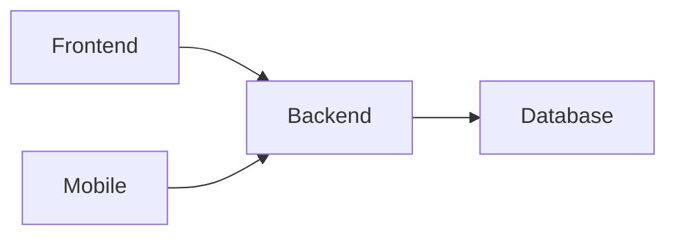

# Resource

My tools that I used

|Full Stack Developer|
|--------------------|
|Frontend            |
|Backend             |
|Database            |
|DevOps              |
|Mobile              |
|Quantity Assurance  |
|Document            |
|Utils               |

<!--Frontend-->

  
Frontend

  ###### UI
  - [React](https://github.com/facebook/react)    
  - [Vue](https://github.com/vuejs/vue)    
  - [Bootstrap](https://github.com/twbs/bootstrap)    
  - [Next](https://github.com/vercel/next.js)    
  - [Ant Design](https://github.com/ant-design/ant-design)    
  - [Tailwind](https://github.com/tailwindlabs/tailwindcss)    
  - [Shadcn](https://github.com/shadcn-ui/ui)    
  - [Bulma](https://github.com/jgthms/bulma)    
  - [Style Components](https://github.com/styled-components/styled-components)    
  - [Tabler](https://github.com/tabler/tabler)    
  - [ChakraUI](https://github.com/chakra-ui/chakra-ui)    
  - [daisyUI](https://github.com/saadeghi/daisyui)    
  - [Remix](https://github.com/remix-run/remix)    
  - [Refine](https://github.com/refinedev/refine)    
  - [Mantine](https://github.com/mantinedev/mantine)    
  - [Tamagui](https://github.com/tamagui/tamagui)    
  - [Prime](https://github.com/primefaces/primereact)    
  - [One](https://github.com/onejs/one)    

<!--backend-->

  
Backend

  - [Laravel](https://github.com/laravel/laravel)    
  - [Nest](https://github.com/nestjs/nest)    
  - [Express](https://github.com/expressjs/express)    
  - [Strapi](https://github.com/strapi/strapi)    
  - [Gatsby](https://github.com/gatsbyjs/gatsby)    
  - [Meteor](https://github.com/meteor/meteor)    
  - [Fastify](https://github.com/fastify/fastify)    
  - [Rocket](https://github.com/rwf2/Rocket)    
  - [Hono](https://github.com/honojs/hono)    
  - [Redwood](https://github.com/redwoodjs/redwood)    
  - [Yii](https://github.com/yiisoft/yii2)    

<!--Database-->

  
Database

  ###### ORM
  - [Prisma](https://github.com/prisma/prisma)    
  - [TypeORM](https://github.com/typeorm/typeorm)    
  - [Sequelize](https://github.com/sequelize/sequelize)    
  - [DrizzleORM](https://github.com/drizzle-team/drizzle-orm)    

  ###### Store
  - [MongoDB](https://github.com/mongodb/mongo)    
  - [TimeScale](https://github.com/timescale/timescaledb)    
  - [MySQL](https://github.com/mysqljs/mysql)    
  - [Postgres](https://github.com/postgres/postgres)    
  - [SQLite](https://github.com/sqlite/sqlite)    
  - [MariaDB](https://github.com/MariaDB/server)    

<!--DevOps-->

  
DevOps

  - [Caddy](https://github.com/caddyserver/caddy)    
  - [PM2](https://github.com/Unitech/pm2)    
  - [Portainer](https://github.com/portainer/portainer)    
  - [Nginx](https://github.com/nginx/nginx)    
  - [Vercel](https://github.com/vercel/vercel)    
  - [Piko](https://github.com/andydunstall/piko)    

<!--mobile-->

  
Mobile

  
  - [Flutter](https://github.com/flutter/flutter)    
  - [React Native](https://github.com/facebook/react-native)    
  - [Expo](https://github.com/expo/expo)    
  - [Dioxus](https://github.com/DioxusLabs/dioxus)    
  - [Lynx](https://github.com/lynx-family/lynx)    

  
Mobile Boilerplace

  - [Ignite](https://github.com/infinitered/ignite)    

<!--Quanlity Assurance-->

  
Quanlity Assurance

  - [Playwright](https://github.com/microsoft/playwright)   
  - [Cypress](https://github.com/cypress-io/cypress)   
  - [Jest](https://github.com/jestjs/jest)   
  - [Sentry](https://github.com/getsentry/sentry)    
  - [Zod](https://github.com/colinhacks/zod)    

<!--Document-->

  
Document

  - [Gitbook](https://github.com/GitbookIO/gitbook)    

<!--Utils-->

  
Utils

  - [Oh Myz](https://github.com/ohmyzsh/ohmyzsh)   
  - [Three](https://github.com/mrdoob/three.js)   
  - [Excalidraw](https://github.com/excalidraw/excalidraw)   
  - [Free4dev](https://github.com/ripienaar/free-for-dev)   
  - [Storybook](https://github.com/storybookjs/storybook)   
  - [Reveal](https://github.com/hakimel/reveal.js)   
  - [n8n](https://github.com/n8n-io/n8n)   
  - [Anime](https://github.com/juliangarnier/anime)   
  - [Moment](https://github.com/moment/moment)   
  - [Dayjs](https://github.com/iamkun/dayjs)   
  - [Typst](https://github.com/typst/typst)   
  - [Slidev](https://github.com/slidevjs/slidev)   
  - [React Flow](https://github.com/xyflow/xyflow)   
  - [Shields](https://github.com/badges/shields)   
  - [MailTrap](https://github.com/railsware/mailtrap-nodejs)   

## Reference
- [My Diary with OSX](https://github.com/prawee/my-daily-tools-osx)
- [My Diary with Window](https://github.com/prawee/my-daily-tools-win)
