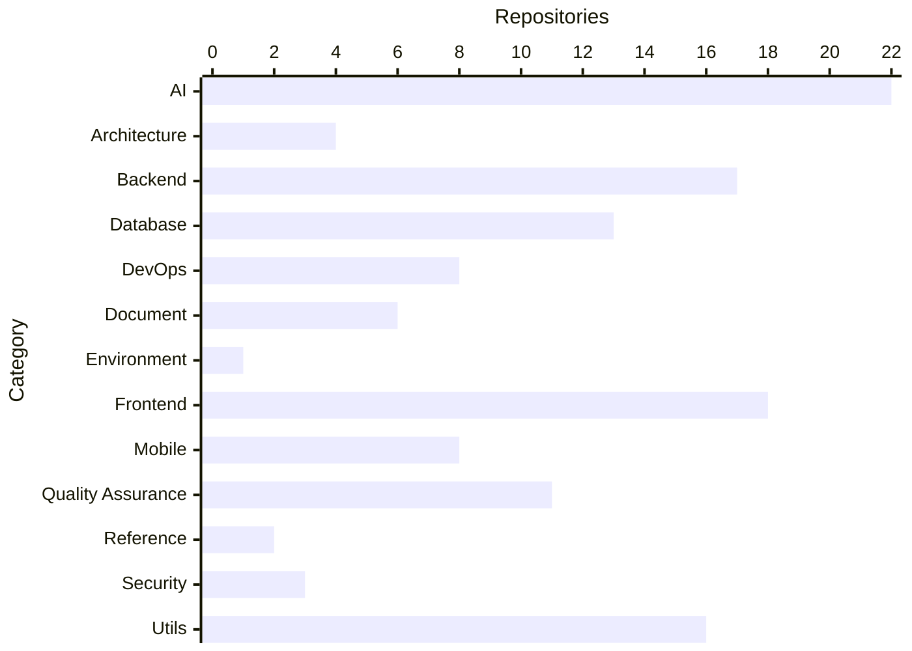

# Resource

My tools that I use and research.

A curated catalog of useful tools and open source projects. Each entry lives in its own Markdown file under [`tools/`](tools/), so the list can grow without a database.

## Overview

The chart shows the number of projects in each category. Star badges are live; GitHub Actions fetches numeric counts daily and sorts entries by stars within each category.


```mermaid
xychart-beta horizontal
    x-axis "Category" ["AI", "Architecture", "Backend", "Database", "DevOps", "Document", "Environment", "Frontend", "Mobile", "Quality Assurance", "Reference", "Security", "Utils"]
    y-axis "Repositories" 0 --> 22
    bar [22, 4, 17, 13, 8, 6, 1, 18, 8, 11, 2, 3, 16]
```

## Categories

[AI](#ai) | [Architecture](#architecture) | [Backend](#backend) | [Database](#database) | [DevOps](#devops) | [Document](#document) | [Environment](#environment) | [Frontend](#frontend) | [Mobile](#mobile) | [Quality Assurance](#quality-assurance) | [Reference](#reference) | [Security](#security) | [Utils](#utils)

## AI

### Agent

- [AI SDK](https://github.com/vercel/ai) — 
- [Flue](https://github.com/withastro/flue) — 
- [LangChainJS](https://github.com/langchain-ai/langchainjs) — 
- [Mastra](https://github.com/mastra-ai/mastra) — 
- [Sim](https://github.com/simstudioai/sim) — 
- [Swarmclaw](https://github.com/swarmclawai/swarmclaw) — 
- [Voltagent](https://github.com/voltagent/voltagent) — 

### Coding

- [Opencastle](https://github.com/monkilabs/opencastle) — 
- [OpenChamber](https://github.com/openchamber/openchamber) — 
- [Optio](https://github.com/jonwiggins/optio) — 

### Generative AI

- [GPT4All](https://github.com/nomic-ai/gpt4all) — 
- [LM Studio](https://github.com/lmstudio-ai/lms) — 
- [LocalAI](https://github.com/mudler/LocalAI) — 
- [Ollama](https://github.com/ollama/ollama) — 
- [vLLM](https://github.com/vllm-project/vllm) — 

### Personal AI Assistant

- [Nanobot](https://github.com/HKUDS/nanobot) — 
- [OpenClaw](https://github.com/openclaw/openclaw) — 

### UI

- [AG UI](https://github.com/ag-ui-protocol/ag-ui) — 
- [AionUi](https://github.com/iOfficeAI/AionUi) — 
- [Assistant UI](https://github.com/assistant-ui/assistant-ui) — 
- [CopilotKit](https://github.com/CopilotKit/CopilotKit) — 
- [Tambo](https://github.com/tambo-ai/tambo) — 

## Architecture

### Packages

- [Nix](https://github.com/NixOS/nixpkgs) — 

### Stack

- [Agent Native](https://github.com/BuilderIO/agent-native) — 
- [Better Stack](https://github.com/better-stack-ai/better-stack) — 
- [Objectstack](https://github.com/objectstack-ai/objectstack) — 

## Backend

- [Elysia](https://github.com/elysiajs/elysia) — 
- [Express](https://github.com/expressjs/express) — 
- [Fastify](https://github.com/fastify/fastify) — 
- [Feathers](https://github.com/feathersjs/feathers) — 
- [Gatsby](https://github.com/gatsbyjs/gatsby) — 
- [Hono](https://github.com/honojs/hono) — 
- [Kong](https://github.com/Kong/kong) — 
- [Laravel](https://github.com/laravel/laravel) — 
- [Meteor](https://github.com/meteor/meteor) — 
- [Nest](https://github.com/nestjs/nest) — 
- [Redwood](https://github.com/redwoodjs/redwood) — 
- [Rocket](https://github.com/rwf2/Rocket) — 
- [SST](https://github.com/sst/sst) — 
- [Yii](https://github.com/yiisoft/yii2) — 

### Headless CMS

- [Directus](https://github.com/directus/directus) — 
- [Strapi](https://github.com/strapi/strapi) — 

### Lambda

- [Bref - PHP](https://github.com/brefphp/bref) — 

## Database

### ORM

- [DrizzleORM](https://github.com/drizzle-team/drizzle-orm) — 
- [Knex](https://github.com/knex/knex) — 
- [MikroORM](https://github.com/mikro-orm/mikro-orm) — 
- [Objection](https://github.com/vincit/objection.js) — 
- [Prisma](https://github.com/prisma/prisma) — 
- [Sequelize](https://github.com/sequelize/sequelize) — 
- [TypeORM](https://github.com/typeorm/typeorm) — 

### Store

- [MariaDB](https://github.com/MariaDB/server) — 
- [MongoDB](https://github.com/mongodb/mongo) — 
- [MySQL](https://github.com/mysqljs/mysql) — 
- [Postgres](https://github.com/postgres/postgres) — 
- [SQLite](https://github.com/sqlite/sqlite) — 
- [TimeScale](https://github.com/timescale/timescaledb) — 

## DevOps

- [Caddy](https://github.com/caddyserver/caddy) — 
- [DDev](https://github.com/ddev/ddev) — 
- [Kool](https://github.com/kool-dev/kool) — 
- [Nginx](https://github.com/nginx/nginx) — 
- [Piko](https://github.com/andydunstall/piko) — 
- [PM2](https://github.com/Unitech/pm2) — 
- [Portainer](https://github.com/portainer/portainer) — 
- [Vercel](https://github.com/vercel/vercel) — 

## Document

- [Docsify](https://github.com/docsifyjs/docsify) — 
- [Docusaurus](https://github.com/facebook/docusaurus) — 
- [Gitbook](https://github.com/GitbookIO/gitbook) — 
- [Mkdocs](https://github.com/mkdocs/mkdocs) — 
- [Outline](https://github.com/outline/outline) — 
- [Siyuan](https://github.com/siyuan-note/siyuan) — 

## Environment

### Python

- [UV](https://github.com/astral-sh/uv) — 

## Frontend

### UI

- [Ant Design](https://github.com/ant-design/ant-design) — 
- [Bootstrap](https://github.com/twbs/bootstrap) — 
- [Bulma](https://github.com/jgthms/bulma) — 
- [ChakraUI](https://github.com/chakra-ui/chakra-ui) — 
- [daisyUI](https://github.com/saadeghi/daisyui) — 
- [Mantine](https://github.com/mantinedev/mantine) — 
- [Next](https://github.com/vercel/next.js) — 
- [One](https://github.com/onejs/one) — 
- [Prime](https://github.com/primefaces/primereact) — 
- [React](https://github.com/facebook/react) — 
- [Refine](https://github.com/refinedev/refine) — 
- [Remix](https://github.com/remix-run/remix) — 
- [Shadcn](https://github.com/shadcn-ui/ui) — 
- [Style Components](https://github.com/styled-components/styled-components) — 
- [Tabler](https://github.com/tabler/tabler) — 
- [Tailwind](https://github.com/tailwindlabs/tailwindcss) — 
- [Tamagui](https://github.com/tamagui/tamagui) — 
- [Vue](https://github.com/vuejs/vue) — 

## Mobile

### Boilerplace

- [Ignite](https://github.com/infinitered/ignite) — 
- [React Native](https://github.com/wataru-maeda/react-native-boilerplate) — 

### Core

- [Dioxus](https://github.com/DioxusLabs/dioxus) — 
- [Expo](https://github.com/expo/expo) — 
- [Flet](https://github.com/flet-dev/flet) — 
- [Flutter](https://github.com/flutter/flutter) — 
- [Lynx](https://github.com/lynx-family/lynx) — 
- [React Native](https://github.com/facebook/react-native) — 

## Quality Assurance

### Application Performance Monitoring

- [SigNoz](https://github.com/SigNoz/signoz) — 

### Automated Testing

- [Cypress](https://github.com/cypress-io/cypress) — 
- [Jest](https://github.com/jestjs/jest) — 
- [Playwright](https://github.com/microsoft/playwright) — 
- [Sentry](https://github.com/getsentry/sentry) — 
- [Zod](https://github.com/colinhacks/zod) — 

### Load Testing

- [Gatling](https://github.com/gatling/gatling) — 
- [JMeter](https://github.com/apache/jmeter) — 
- [K6](https://github.com/grafana/k6) — 
- [Locust](https://github.com/locustio/locust) — 
- [Taurus](https://github.com/Blazemeter/taurus) — 

## Reference

- [My Diary with OSX](https://github.com/prawee/my-daily-tools-osx) — 
- [My Diary with Window](https://github.com/prawee/my-daily-tools-win) — 

## Security

### Password Manager

- [Passbolt](https://github.com/passbolt/passbolt_api) — 
- [Vaultwarden](https://github.com/dani-garcia/vaultwarden) — 

### Static Application Security Testing (SAST)

- [Semgrep](https://github.com/semgrep/semgrep) — 

## Utils

- [Anime](https://github.com/juliangarnier/anime) — 
- [Dayjs](https://github.com/iamkun/dayjs) — 
- [Excalidraw](https://github.com/excalidraw/excalidraw) — 
- [Free4dev](https://github.com/ripienaar/free-for-dev) — 
- [MailTrap](https://github.com/railsware/mailtrap-nodejs) — 
- [Moment](https://github.com/moment/moment) — 
- [n8n](https://github.com/n8n-io/n8n) — 
- [Oh Myz](https://github.com/ohmyzsh/ohmyzsh) — 
- [PptxGenJS](https://github.com/gitbrent/PptxGenJS) — 
- [React Flow](https://github.com/xyflow/xyflow) — 
- [Reveal](https://github.com/hakimel/reveal.js) — 
- [Shields](https://github.com/badges/shields) — 
- [Slidev](https://github.com/slidevjs/slidev) — 
- [Storybook](https://github.com/storybookjs/storybook) — 
- [Three](https://github.com/mrdoob/three.js) — 
- [Typst](https://github.com/typst/typst) — 

## Add a tool

Create a Markdown file in `tools/` with this front matter, then run `python3 scripts/build_readme.py`:

```markdown
---
name: "Example Tool"
category: "Developer Tools"
subcategory: "Optional group"
repository: "owner/repository"
description: "Optional short description"
---

Notes about the tool can go here.
```

GitHub stars are refreshed automatically every day by GitHub Actions. To refresh and sort locally, set `GITHUB_TOKEN` and run `python3 scripts/build_readme.py`.
