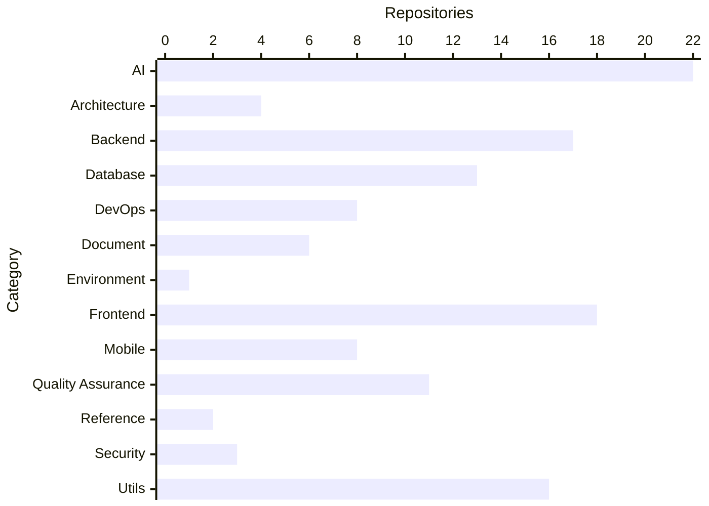

# Resource

My tools that I use and research.

A curated catalog of useful tools and open source projects. Each entry lives in its own Markdown file under [`tools/`](tools/), so the list can grow without a database.

## Overview

The chart shows the number of projects in each category. Star badges are live; GitHub Actions fetches numeric counts daily and sorts entries by stars within each category.


```mermaid
xychart-beta horizontal
    x-axis "Category" ["AI", "Architecture", "Backend", "Database", "DevOps", "Document", "Environment", "Frontend", "Mobile", "Quality Assurance", "Reference", "Security", "Utils"]
    y-axis "Repositories" 0 --> 22
    bar [22, 4, 17, 13, 8, 6, 1, 18, 8, 11, 2, 3, 16]
```

## Categories

[AI](#ai) | [Architecture](#architecture) | [Backend](#backend) | [Database](#database) | [DevOps](#devops) | [Document](#document) | [Environment](#environment) | [Frontend](#frontend) | [Mobile](#mobile) | [Quality Assurance](#quality-assurance) | [Reference](#reference) | [Security](#security) | [Utils](#utils)

<a id="ai"></a>
<details open>
<summary>AI (22)</summary>

#### Agent

- [AI SDK](https://github.com/vercel/ai) —   
- [Flue](https://github.com/withastro/flue) —   
- [LangChainJS](https://github.com/langchain-ai/langchainjs) —   
- [Mastra](https://github.com/mastra-ai/mastra) —   
- [Sim](https://github.com/simstudioai/sim) —   
- [Swarmclaw](https://github.com/swarmclawai/swarmclaw) —   
- [Voltagent](https://github.com/voltagent/voltagent) —   

#### Coding

- [Opencastle](https://github.com/monkilabs/opencastle) —   
- [OpenChamber](https://github.com/openchamber/openchamber) —   
- [Optio](https://github.com/jonwiggins/optio) —   

#### Generative AI

- [GPT4All](https://github.com/nomic-ai/gpt4all) —   
- [LM Studio](https://github.com/lmstudio-ai/lms) —   
- [LocalAI](https://github.com/mudler/LocalAI) —   
- [Ollama](https://github.com/ollama/ollama) —   
- [vLLM](https://github.com/vllm-project/vllm) —   

#### Personal AI Assistant

- [Nanobot](https://github.com/HKUDS/nanobot) —   
- [OpenClaw](https://github.com/openclaw/openclaw) —   

#### UI

- [AG UI](https://github.com/ag-ui-protocol/ag-ui) —   
- [AionUi](https://github.com/iOfficeAI/AionUi) —   
- [Assistant UI](https://github.com/assistant-ui/assistant-ui) —   
- [CopilotKit](https://github.com/CopilotKit/CopilotKit) —   
- [Tambo](https://github.com/tambo-ai/tambo) —   

</details>

<a id="architecture"></a>
<details open>
<summary>Architecture (4)</summary>

#### Packages

- [Nix](https://github.com/NixOS/nixpkgs) —   

#### Stack

- [Agent Native](https://github.com/BuilderIO/agent-native) —   
- [Better Stack](https://github.com/better-stack-ai/better-stack) —   
- [Objectstack](https://github.com/objectstack-ai/objectstack) —   

</details>

<a id="backend"></a>
<details open>
<summary>Backend (17)</summary>

- [Elysia](https://github.com/elysiajs/elysia) —   
- [Express](https://github.com/expressjs/express) —   
- [Fastify](https://github.com/fastify/fastify) —   
- [Feathers](https://github.com/feathersjs/feathers) —   
- [Gatsby](https://github.com/gatsbyjs/gatsby) —   
- [Hono](https://github.com/honojs/hono) —   
- [Kong](https://github.com/Kong/kong) —   
- [Laravel](https://github.com/laravel/laravel) —   
- [Meteor](https://github.com/meteor/meteor) —   
- [Nest](https://github.com/nestjs/nest) —   
- [Redwood](https://github.com/redwoodjs/redwood) —   
- [Rocket](https://github.com/rwf2/Rocket) —   
- [SST](https://github.com/sst/sst) —   
- [Yii](https://github.com/yiisoft/yii2) —   

#### Headless CMS

- [Directus](https://github.com/directus/directus) —   
- [Strapi](https://github.com/strapi/strapi) —   

#### Lambda

- [Bref - PHP](https://github.com/brefphp/bref) —   

</details>

<a id="database"></a>
<details open>
<summary>Database (13)</summary>

#### ORM

- [DrizzleORM](https://github.com/drizzle-team/drizzle-orm) —   
- [Knex](https://github.com/knex/knex) —   
- [MikroORM](https://github.com/mikro-orm/mikro-orm) —   
- [Objection](https://github.com/vincit/objection.js) —   
- [Prisma](https://github.com/prisma/prisma) —   
- [Sequelize](https://github.com/sequelize/sequelize) —   
- [TypeORM](https://github.com/typeorm/typeorm) —   

#### Store

- [MariaDB](https://github.com/MariaDB/server) —   
- [MongoDB](https://github.com/mongodb/mongo) —   
- [MySQL](https://github.com/mysqljs/mysql) —   
- [Postgres](https://github.com/postgres/postgres) —   
- [SQLite](https://github.com/sqlite/sqlite) —   
- [TimeScale](https://github.com/timescale/timescaledb) —   

</details>

<a id="devops"></a>
<details open>
<summary>DevOps (8)</summary>

- [Caddy](https://github.com/caddyserver/caddy) —   
- [DDev](https://github.com/ddev/ddev) —   
- [Kool](https://github.com/kool-dev/kool) —   
- [Nginx](https://github.com/nginx/nginx) —   
- [Piko](https://github.com/andydunstall/piko) —   
- [PM2](https://github.com/Unitech/pm2) —   
- [Portainer](https://github.com/portainer/portainer) —   
- [Vercel](https://github.com/vercel/vercel) —   

</details>

<a id="document"></a>
<details open>
<summary>Document (6)</summary>

- [Docsify](https://github.com/docsifyjs/docsify) —   
- [Docusaurus](https://github.com/facebook/docusaurus) —   
- [Gitbook](https://github.com/GitbookIO/gitbook) —   
- [Mkdocs](https://github.com/mkdocs/mkdocs) —   
- [Outline](https://github.com/outline/outline) —   
- [Siyuan](https://github.com/siyuan-note/siyuan) —   

</details>

<a id="environment"></a>
<details open>
<summary>Environment (1)</summary>

#### Python

- [UV](https://github.com/astral-sh/uv) —   

</details>

<a id="frontend"></a>
<details open>
<summary>Frontend (18)</summary>

#### UI

- [Ant Design](https://github.com/ant-design/ant-design) —   
- [Bootstrap](https://github.com/twbs/bootstrap) —   
- [Bulma](https://github.com/jgthms/bulma) —   
- [ChakraUI](https://github.com/chakra-ui/chakra-ui) —   
- [daisyUI](https://github.com/saadeghi/daisyui) —   
- [Mantine](https://github.com/mantinedev/mantine) —   
- [Next](https://github.com/vercel/next.js) —   
- [One](https://github.com/onejs/one) —   
- [Prime](https://github.com/primefaces/primereact) —   
- [React](https://github.com/facebook/react) —   
- [Refine](https://github.com/refinedev/refine) —   
- [Remix](https://github.com/remix-run/remix) —   
- [Shadcn](https://github.com/shadcn-ui/ui) —   
- [Style Components](https://github.com/styled-components/styled-components) —   
- [Tabler](https://github.com/tabler/tabler) —   
- [Tailwind](https://github.com/tailwindlabs/tailwindcss) —   
- [Tamagui](https://github.com/tamagui/tamagui) —   
- [Vue](https://github.com/vuejs/vue) —   

</details>

<a id="mobile"></a>
<details open>
<summary>Mobile (8)</summary>

#### Boilerplace

- [Ignite](https://github.com/infinitered/ignite) —   
- [React Native](https://github.com/wataru-maeda/react-native-boilerplate) —   

#### Core

- [Dioxus](https://github.com/DioxusLabs/dioxus) —   
- [Expo](https://github.com/expo/expo) —   
- [Flet](https://github.com/flet-dev/flet) —   
- [Flutter](https://github.com/flutter/flutter) —   
- [Lynx](https://github.com/lynx-family/lynx) —   
- [React Native](https://github.com/facebook/react-native) —   

</details>

<a id="quality-assurance"></a>
<details open>
<summary>Quality Assurance (11)</summary>

#### Application Performance Monitoring

- [SigNoz](https://github.com/SigNoz/signoz) —   

#### Automated Testing

- [Cypress](https://github.com/cypress-io/cypress) —   
- [Jest](https://github.com/jestjs/jest) —   
- [Playwright](https://github.com/microsoft/playwright) —   
- [Sentry](https://github.com/getsentry/sentry) —   
- [Zod](https://github.com/colinhacks/zod) —   

#### Load Testing

- [Gatling](https://github.com/gatling/gatling) —   
- [JMeter](https://github.com/apache/jmeter) —   
- [K6](https://github.com/grafana/k6) —   
- [Locust](https://github.com/locustio/locust) —   
- [Taurus](https://github.com/Blazemeter/taurus) —   

</details>

<a id="reference"></a>
<details open>
<summary>Reference (2)</summary>

- [My Diary with OSX](https://github.com/prawee/my-daily-tools-osx) —   
- [My Diary with Window](https://github.com/prawee/my-daily-tools-win) —   

</details>

<a id="security"></a>
<details open>
<summary>Security (3)</summary>

#### Password Manager

- [Passbolt](https://github.com/passbolt/passbolt_api) —   
- [Vaultwarden](https://github.com/dani-garcia/vaultwarden) —   

#### Static Application Security Testing (SAST)

- [Semgrep](https://github.com/semgrep/semgrep) —   

</details>

<a id="utils"></a>
<details open>
<summary>Utils (16)</summary>

- [Anime](https://github.com/juliangarnier/anime) —   
- [Dayjs](https://github.com/iamkun/dayjs) —   
- [Excalidraw](https://github.com/excalidraw/excalidraw) —   
- [Free4dev](https://github.com/ripienaar/free-for-dev) —   
- [MailTrap](https://github.com/railsware/mailtrap-nodejs) —   
- [Moment](https://github.com/moment/moment) —   
- [n8n](https://github.com/n8n-io/n8n) —   
- [Oh Myz](https://github.com/ohmyzsh/ohmyzsh) —   
- [PptxGenJS](https://github.com/gitbrent/PptxGenJS) —   
- [React Flow](https://github.com/xyflow/xyflow) —   
- [Reveal](https://github.com/hakimel/reveal.js) —   
- [Shields](https://github.com/badges/shields) —   
- [Slidev](https://github.com/slidevjs/slidev) —   
- [Storybook](https://github.com/storybookjs/storybook) —   
- [Three](https://github.com/mrdoob/three.js) —   
- [Typst](https://github.com/typst/typst) —   

</details>

## Add a tool

Create a Markdown file in `tools/` with this front matter, then run `python3 scripts/build_readme.py`:

```markdown
---
name: "Example Tool"
category: "Developer Tools"
subcategory: "Optional group"
repository: "owner/repository"
description: "Optional short description"
---

Notes about the tool can go here.
```

GitHub stars are refreshed automatically every day by GitHub Actions. To refresh and sort locally, set `GITHUB_TOKEN` and run `python3 scripts/build_readme.py`.
