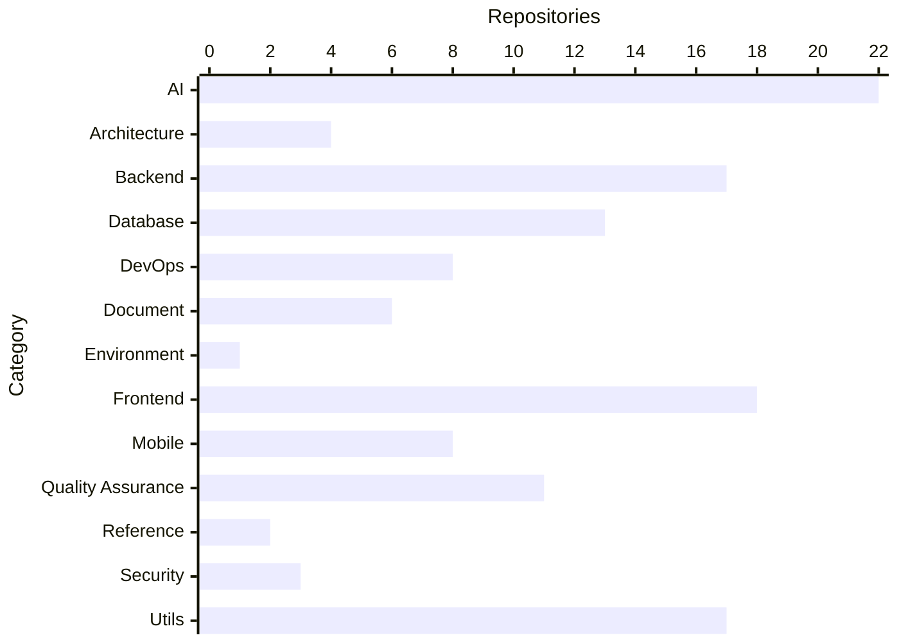

# Resource

My tools that I use and research.

A curated catalog of useful tools and open source projects. Each entry lives in its own Markdown file under [`tools/`](tools/), so the list can grow without a database.

## Overview

The chart shows the number of projects in each category. Star badges are live; GitHub Actions fetches numeric counts daily and sorts entries by stars within each category.


```mermaid
xychart-beta horizontal
    x-axis "Category" ["AI", "Architecture", "Backend", "Database", "DevOps", "Document", "Environment", "Frontend", "Mobile", "Quality Assurance", "Reference", "Security", "Utils"]
    y-axis "Repositories" 0 --> 22
    bar [22, 4, 17, 13, 8, 6, 1, 18, 8, 11, 2, 3, 17]
```

## Categories

[AI](#ai) | [Architecture](#architecture) | [Backend](#backend) | [Database](#database) | [DevOps](#devops) | [Document](#document) | [Environment](#environment) | [Frontend](#frontend) | [Mobile](#mobile) | [Quality Assurance](#quality-assurance) | [Reference](#reference) | [Security](#security) | [Utils](#utils)

<a id="ai"></a>
<details open>
<summary>AI (22)</summary>

#### Agent

- [Sim](https://github.com/simstudioai/sim) —   ⭐ 29,784
- [Mastra](https://github.com/mastra-ai/mastra) —   ⭐ 28,586
- [AI SDK](https://github.com/vercel/ai) —   ⭐ 27,136
- [LangChainJS](https://github.com/langchain-ai/langchainjs) —   ⭐ 18,248
- [Voltagent](https://github.com/voltagent/voltagent) —   ⭐ 10,736
- [Flue](https://github.com/withastro/flue) —   ⭐ 8,425
- [Swarmclaw](https://github.com/swarmclawai/swarmclaw) —   ⭐ 688

#### Coding

- [OpenChamber](https://github.com/openchamber/openchamber) —   ⭐ 11,191
- [Optio](https://github.com/jonwiggins/optio) —   ⭐ 1,061
- [Opencastle](https://github.com/monkilabs/opencastle) —   ⭐ 80

#### Generative AI

- [Ollama](https://github.com/ollama/ollama) —   ⭐ 182,305
- [vLLM](https://github.com/vllm-project/vllm) —   ⭐ 93,251
- [GPT4All](https://github.com/nomic-ai/gpt4all) —   ⭐ 77,386
- [LocalAI](https://github.com/mudler/LocalAI) —   ⭐ 49,407
- [LM Studio](https://github.com/lmstudio-ai/lms) —   ⭐ 5,330

#### Personal AI Assistant

- [OpenClaw](https://github.com/openclaw/openclaw) —   ⭐ 391,479
- [Nanobot](https://github.com/HKUDS/nanobot) —   ⭐ 48,815

#### UI

- [CopilotKit](https://github.com/CopilotKit/CopilotKit) —   ⭐ 37,770
- [AionUi](https://github.com/iOfficeAI/AionUi) —   ⭐ 33,338
- [AG UI](https://github.com/ag-ui-protocol/ag-ui) —   ⭐ 16,341
- [Assistant UI](https://github.com/assistant-ui/assistant-ui) —   ⭐ 12,418
- [Tambo](https://github.com/tambo-ai/tambo) —   ⭐ 11,183

</details>

<a id="architecture"></a>
<details open>
<summary>Architecture (4)</summary>

#### Packages

- [Nix](https://github.com/NixOS/nixpkgs) —   ⭐ 26,375

#### Stack

- [Agent Native](https://github.com/BuilderIO/agent-native) —   ⭐ 7,071
- [Better Stack](https://github.com/better-stack-ai/better-stack) —   ⭐ 77
- [Objectstack](https://github.com/objectstack-ai/objectstack) —   ⭐ 68

</details>

<a id="backend"></a>
<details open>
<summary>Backend (17)</summary>

- [Laravel](https://github.com/laravel/laravel) —   ⭐ 85,057
- [Nest](https://github.com/nestjs/nest) —   ⭐ 76,794
- [Express](https://github.com/expressjs/express) —   ⭐ 69,553
- [Gatsby](https://github.com/gatsbyjs/gatsby) —   ⭐ 55,943
- [Meteor](https://github.com/meteor/meteor) —   ⭐ 44,799
- [Kong](https://github.com/Kong/kong) —   ⭐ 44,242
- [Fastify](https://github.com/fastify/fastify) —   ⭐ 37,233
- [Hono](https://github.com/honojs/hono) —   ⭐ 32,420
- [Rocket](https://github.com/rwf2/Rocket) —   ⭐ 25,782
- [Elysia](https://github.com/elysiajs/elysia) —   ⭐ 19,217
- [Feathers](https://github.com/feathersjs/feathers) —   ⭐ 15,256
- [Yii](https://github.com/yiisoft/yii2) —   ⭐ 14,285
- [Redwood](https://github.com/redwoodjs/redwood) —   
- [SST](https://github.com/sst/sst) —   

#### Headless CMS

- [Strapi](https://github.com/strapi/strapi) —   ⭐ 73,284
- [Directus](https://github.com/directus/directus) —   ⭐ 38,031

#### Lambda

- [Bref - PHP](https://github.com/brefphp/bref) —   ⭐ 3,403

</details>

<a id="database"></a>
<details open>
<summary>Database (13)</summary>

#### ORM

- [TypeORM](https://github.com/typeorm/typeorm) —   ⭐ 36,662
- [DrizzleORM](https://github.com/drizzle-team/drizzle-orm) —   ⭐ 35,962
- [Sequelize](https://github.com/sequelize/sequelize) —   ⭐ 30,356
- [Knex](https://github.com/knex/knex) —   ⭐ 20,339
- [MikroORM](https://github.com/mikro-orm/mikro-orm) —   ⭐ 9,244
- [Objection](https://github.com/vincit/objection.js) —   ⭐ 7,340
- [Prisma](https://github.com/prisma/prisma) —   

#### Store

- [MongoDB](https://github.com/mongodb/mongo) —   ⭐ 28,616
- [TimeScale](https://github.com/timescale/timescaledb) —   ⭐ 23,647
- [Postgres](https://github.com/postgres/postgres) —   ⭐ 22,295
- [MySQL](https://github.com/mysqljs/mysql) —   ⭐ 18,606
- [SQLite](https://github.com/sqlite/sqlite) —   ⭐ 10,606
- [MariaDB](https://github.com/MariaDB/server) —   ⭐ 8,321

</details>

<a id="devops"></a>
<details open>
<summary>DevOps (8)</summary>

- [Caddy](https://github.com/caddyserver/caddy) —   ⭐ 77,319
- [PM2](https://github.com/Unitech/pm2) —   ⭐ 43,299
- [Portainer](https://github.com/portainer/portainer) —   ⭐ 38,620
- [Nginx](https://github.com/nginx/nginx) —   ⭐ 31,801
- [Vercel](https://github.com/vercel/vercel) —   ⭐ 16,344
- [DDev](https://github.com/ddev/ddev) —   ⭐ 3,902
- [Piko](https://github.com/andydunstall/piko) —   ⭐ 2,194
- [Kool](https://github.com/kool-dev/kool) —   ⭐ 727

</details>

<a id="document"></a>
<details open>
<summary>Document (6)</summary>

- [Docusaurus](https://github.com/facebook/docusaurus) —   ⭐ 66,428
- [Siyuan](https://github.com/siyuan-note/siyuan) —   ⭐ 46,639
- [Outline](https://github.com/outline/outline) —   ⭐ 40,820
- [Docsify](https://github.com/docsifyjs/docsify) —   ⭐ 31,542
- [Gitbook](https://github.com/GitbookIO/gitbook) —   ⭐ 29,061
- [Mkdocs](https://github.com/mkdocs/mkdocs) —   ⭐ 22,495

</details>

<a id="environment"></a>
<details open>
<summary>Environment (1)</summary>

#### Python

- [UV](https://github.com/astral-sh/uv) —   ⭐ 90,428

</details>

<a id="frontend"></a>
<details open>
<summary>Frontend (18)</summary>

#### UI

- [Vue](https://github.com/vuejs/vue) —   ⭐ 212,821
- [Bootstrap](https://github.com/twbs/bootstrap) —   ⭐ 174,985
- [Next](https://github.com/vercel/next.js) —   ⭐ 143,217
- [Shadcn](https://github.com/shadcn-ui/ui) —   ⭐ 125,188
- [Ant Design](https://github.com/ant-design/ant-design) —   ⭐ 99,694
- [Tailwind](https://github.com/tailwindlabs/tailwindcss) —   ⭐ 97,774
- [Bulma](https://github.com/jgthms/bulma) —   ⭐ 50,052
- [daisyUI](https://github.com/saadeghi/daisyui) —   ⭐ 42,547
- [Tabler](https://github.com/tabler/tabler) —   ⭐ 41,820
- [Style Components](https://github.com/styled-components/styled-components) —   ⭐ 41,096
- [ChakraUI](https://github.com/chakra-ui/chakra-ui) —   ⭐ 40,676
- [Refine](https://github.com/refinedev/refine) —   ⭐ 35,764
- [Remix](https://github.com/remix-run/remix) —   ⭐ 33,390
- [Mantine](https://github.com/mantinedev/mantine) —   ⭐ 31,799
- [Tamagui](https://github.com/tamagui/tamagui) —   ⭐ 14,213
- [Prime](https://github.com/primefaces/primereact) —   ⭐ 8,308
- [One](https://github.com/onejs/one) —   ⭐ 4,491
- [React](https://github.com/facebook/react) —   

</details>

<a id="mobile"></a>
<details open>
<summary>Mobile (8)</summary>

#### Boilerplace

- [Ignite](https://github.com/infinitered/ignite) —   ⭐ 19,939
- [React Native](https://github.com/wataru-maeda/react-native-boilerplate) —   ⭐ 517

#### Core

- [Flutter](https://github.com/flutter/flutter) —   ⭐ 179,359
- [Expo](https://github.com/expo/expo) —   ⭐ 52,581
- [Dioxus](https://github.com/DioxusLabs/dioxus) —   ⭐ 39,326
- [Flet](https://github.com/flet-dev/flet) —   ⭐ 17,260
- [Lynx](https://github.com/lynx-family/lynx) —   ⭐ 15,146
- [React Native](https://github.com/facebook/react-native) —   

</details>

<a id="quality-assurance"></a>
<details open>
<summary>Quality Assurance (11)</summary>

#### Application Performance Monitoring

- [SigNoz](https://github.com/SigNoz/signoz) —   ⭐ 32,290

#### Automated Testing

- [Playwright](https://github.com/microsoft/playwright) —   ⭐ 97,164
- [Cypress](https://github.com/cypress-io/cypress) —   ⭐ 51,040
- [Jest](https://github.com/jestjs/jest) —   ⭐ 45,522
- [Sentry](https://github.com/getsentry/sentry) —   ⭐ 45,481
- [Zod](https://github.com/colinhacks/zod) —   ⭐ 44,065

#### Load Testing

- [K6](https://github.com/grafana/k6) —   ⭐ 31,801
- [Locust](https://github.com/locustio/locust) —   ⭐ 28,199
- [JMeter](https://github.com/apache/jmeter) —   ⭐ 9,552
- [Gatling](https://github.com/gatling/gatling) —   ⭐ 6,958
- [Taurus](https://github.com/Blazemeter/taurus) —   ⭐ 2,117

</details>

<a id="reference"></a>
<details open>
<summary>Reference (2)</summary>

- [My Diary with OSX](https://github.com/prawee/my-daily-tools-osx) —   ⭐ 5
- [My Diary with Window](https://github.com/prawee/my-daily-tools-win) —   ⭐ 0

</details>

<a id="security"></a>
<details open>
<summary>Security (3)</summary>

#### Password Manager

- [Vaultwarden](https://github.com/dani-garcia/vaultwarden) —   ⭐ 68,584
- [Passbolt](https://github.com/passbolt/passbolt_api) —   ⭐ 6,149

#### Static Application Security Testing (SAST)

- [Semgrep](https://github.com/semgrep/semgrep) —   ⭐ 16,895

</details>

<a id="utils"></a>
<details open>
<summary>Utils (17)</summary>

- [n8n](https://github.com/n8n-io/n8n) —   ⭐ 206,748
- [Oh Myz](https://github.com/ohmyzsh/ohmyzsh) —   ⭐ 190,181
- [Free4dev](https://github.com/ripienaar/free-for-dev) —   ⭐ 139,252
- [Excalidraw](https://github.com/excalidraw/excalidraw) —   ⭐ 133,588
- [Three](https://github.com/mrdoob/three.js) —   ⭐ 116,272
- [Storybook](https://github.com/storybookjs/storybook) —   ⭐ 91,204
- [Anime](https://github.com/juliangarnier/anime) —   ⭐ 73,379
- [Reveal](https://github.com/hakimel/reveal.js) —   ⭐ 72,383
- [Remotion](https://github.com/remotion-dev/remotion) —   ⭐ 62,098
- [Typst](https://github.com/typst/typst) —   ⭐ 56,429
- [Slidev](https://github.com/slidevjs/slidev) —   ⭐ 48,934
- [Dayjs](https://github.com/iamkun/dayjs) —   ⭐ 48,664
- [Moment](https://github.com/moment/moment) —   ⭐ 47,902
- [React Flow](https://github.com/xyflow/xyflow) —   ⭐ 38,586
- [Shields](https://github.com/badges/shields) —   ⭐ 27,242
- [PptxGenJS](https://github.com/gitbrent/PptxGenJS) —   ⭐ 6,227
- [MailTrap](https://github.com/railsware/mailtrap-nodejs) —   

</details>

## Add a tool

Create a Markdown file in `tools/` with this front matter, then run `python3 scripts/build_readme.py`:

```markdown
---
name: "Example Tool"
category: "Developer Tools"
subcategory: "Optional group"
repository: "owner/repository"
description: "Optional short description"
---

Notes about the tool can go here.
```

GitHub stars are refreshed automatically every day by GitHub Actions. To refresh and sort locally, set `GITHUB_TOKEN` and run `python3 scripts/build_readme.py`.
